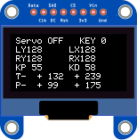

# pid-balanceplate
Servo-controlled Balance Plate using Arduino / STM32 

## Assembly
 - When looking at the plate from the front, the ribbon for the resistive plate should be on the left, and there is a hole for the steel ball to be inserted at the front right corner of the base.
 - The servos are connected to the controller so that the near-left servo connects to the front-most socket, and the servo at the back-right connects to the socket closer to the PS2 connector. Both are connected so that the ground wire is closest to the outside edge of the board, then power in the middle, and signal line on the inside. (CAUTION: the servo extension lead supplied with mine had wires in a different order from the servo itself!)

## Method of Operation
 - The control unit has an ON/OFF switch, a RESET button, and a USER button. Input is via a PS2-style joypad. 
 - There are two LEDs (Red LED L1 and Blue LED L1), both of which will light solid while the unit is on.
 - Pressing USER button toggles the servo outputs on/off. 
 - The plate is controlled by a PS2 controller:
   * Left Analog Stick : Move target point
   * Buttons : Trace shape
 - To adjust the PID parameters, hold the Right Analog Stick and then simulataneusly press any direction on the D-Pad
   * Right Analog Stick X left/right : Decrease/Increase KP
   * Right Analog Stick Y down/up : Decrease/Increase KD

## Display
OLED readout shows values as follows:
 - Servo state (on / off)
 - Keycode of any PS2 buttons currently pressed
 - X/Y value of left joystick
 - X/Y value of right joystick
 - KP, KD PID control values
 - Target X/Y (left hand side)
 - Measured X/Y (right hand side)

## Code Structure
 - The main() program loop is contained in USER\MiniBalance.c, but you'll find it quite sparse - it begins by initialising all the hardware and then enters an infinite while() loop whose only function appears to be to update the display.
 - The reason is that the control loop is actually contained in the TIM1_UP_IRQHandler() function defined in BALANCE\CONTROL\control.c. This is an interrupt, as described at https://www.keil.com/pack/doc/CMSIS/Core/html/using_CMSIS.html. The original code comments state that it is triggered by the interrupt from a MPU6050, but that must be incorrect as there is no such component in the schematic, so seems to be based on internal interrupt timer instead. Calling this function at fixed, regular intervals makes PID updates more reliable. The control handler is responsible for:
   * Reading position input from screen
   * Kinematic Analysis
   * Setting PWM angle of servos
